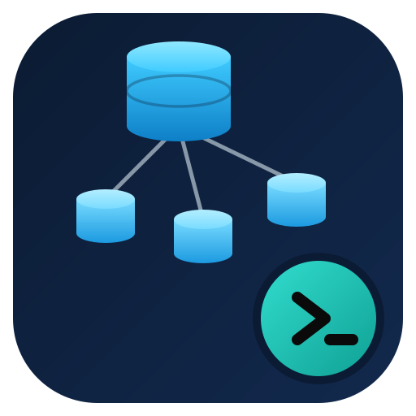

<div align="center">



# PSAzureSQLElasticJob

</div>

A PowerShell module for managing [Azure SQL Elastic Jobs](https://learn.microsoft.com/azure/azure-sql/database/elastic-jobs-overview) - running T-SQL scripts across many Azure SQL databases on a schedule or on demand.

It wraps `Az.Sql`'s Elastic Jobs cmdlets with:

- **Idempotent create commands** (`New-*`) that return the existing resource unchanged instead of erroring when it already exists.
- **Non-throwing `Get-*` commands** that return `$null` instead of throwing when a resource does not exist, so they can be used directly in conditional logic.
- **Consistent `-Strict`/`-PassThru` semantics** on every `Remove-*` command.
- **`-WhatIf`/`-Confirm` support** throughout.
- Support for **Microsoft Entra (Azure AD) user-assigned managed identities** as the recommended, credential-free way to authenticate job steps against target databases.
- **Tab completion** for resource group, server, database, agent, job, step, credential and target group names, scoped by whatever earlier parameters are already typed.

## Requirements

- PowerShell 7.0 or later
- [`Az.Accounts`](https://www.powershellgallery.com/packages/Az.Accounts) >= 2.13.0
- [`Az.Sql`](https://www.powershellgallery.com/packages/Az.Sql) >= 4.0.0
- [`Az.ManagedServiceIdentity`](https://www.powershellgallery.com/packages/Az.ManagedServiceIdentity) >= 2.0.0 (only needed for managed identity commands)
- [`Az.Resources`](https://www.powershellgallery.com/packages/Az.Resources) >= 6.0.0
- [`dbatools`](https://www.powershellgallery.com/packages/dbatools) >= 2.1.0 (only needed for `Grant-SqlElasticJobTargetDatabaseAccess` and `Get-SqlElasticJobExecutionOutput`, which connect to Azure SQL directly to run T-SQL)
- [`PSFramework`](https://www.powershellgallery.com/packages/PSFramework) >= 1.9.310
- An active, signed-in Az context (`Connect-AzAccount`) - every command asserts one is present before doing anything.

## Installation

```powershell
Install-Module -Name PSAzureSQLElasticJob -Scope CurrentUser
```

## Quick start

The example below provisions a complete environment - server, job database, agent, a managed identity, a target database, a job with two steps (one of them writing its results to an output table), and then runs the job and reads the output back.

```powershell
Connect-AzAccount

# 1. Provision the logical SQL server, job database, Elastic Job agent and a
#    user-assigned managed identity in one idempotent call.
$credential = Get-Credential -UserName 'sqladmin'
New-SqlElasticJobEnvironment `
    -ResourceGroupName 'rg-jobs' -ServerName 'sql-jobs' -DatabaseName 'jobdb' -AgentName 'agent01' `
    -Location 'westeurope' -ServerAdministratorCredential $credential `
    -CreateUserAssignedManagedIdentity -UserAssignedIdentityName 'id-jobs'

# 2. Define what the job runs against.
New-SqlElasticJobTargetGroup -ResourceGroupName 'rg-jobs' -ServerName 'sql-jobs' -AgentName 'agent01' -Name 'targetgroup01' |
    Add-SqlElasticJobTarget -TargetServerName 'sql-app' -TargetDatabaseName 'AppDb'

# 3. Grant the managed identity a database user + role on the target so job
#    steps can authenticate without a stored credential.
Grant-SqlElasticJobTargetDatabaseAccess -TargetServerName 'sql-app' -TargetDatabaseName 'AppDb' -IdentityName 'id-jobs'

# 4. Create the job and its steps.
New-SqlElasticJob -ResourceGroupName 'rg-jobs' -ServerName 'sql-jobs' -AgentName 'agent01' -Name 'nightly-report' -RunOnce

Add-SqlElasticJobStep -ResourceGroupName 'rg-jobs' -ServerName 'sql-jobs' -AgentName 'agent01' -JobName 'nightly-report' `
    -Name 'collect-counts' -TargetGroupName 'targetgroup01' -CommandText 'SELECT COUNT(*) AS RowCount FROM dbo.Orders'

# Steps with an output table must select $(job_execution_id) explicitly -
# Azure's own system-managed output column cannot be correlated back to a run.
$outputDatabase = Get-AzSqlDatabase -ResourceGroupName 'rg-jobs' -ServerName 'sql-jobs' -DatabaseName 'reporting'
Add-SqlElasticJobStep -ResourceGroupName 'rg-jobs' -ServerName 'sql-jobs' -AgentName 'agent01' -JobName 'nightly-report' `
    -Name 'collect-counts-with-output' -TargetGroupName 'targetgroup01' `
    -CommandText 'SELECT $(job_execution_id) AS JobExecutionId, COUNT(*) AS RowCount FROM dbo.Orders' `
    -OutputDatabaseObject $outputDatabase -OutputTableName 'OrderCounts'

# 5. Run it and read the results back.
$execution = Start-SqlElasticJob -ResourceGroupName 'rg-jobs' -ServerName 'sql-jobs' -AgentName 'agent01' -Name 'nightly-report' -Wait

Get-SqlElasticJobExecutionOutput -OutputServerName 'sql-jobs' -OutputDatabaseName 'reporting' `
    -OutputTableName 'OrderCounts' -JobExecutionId $execution.JobExecutionId
```

## Command reference

### Environment

| Command                                   | Description                                                                                                                                                          |
| ----------------------------------------- | -------------------------------------------------------------------------------------------------------------------------------------------------------------------- |
| `New-SqlElasticJobEnvironment`            | Idempotently provisions the logical SQL server, job database and Elastic Job agent, optionally assigning or creating a user-assigned managed identity for the agent. |
| `Test-SqlElasticJobEnvironment`           | Reports which parts of an environment exist, without changing anything.                                                                                              |
| `New-SqlElasticJobUserAssignedIdentity`   | Idempotently creates a user-assigned managed identity.                                                                                                               |
| `Grant-SqlElasticJobTargetDatabaseAccess` | Idempotently creates a contained database user for a managed identity on a target database and adds it to a role (`db_owner` by default).                            |

### Agents

| Command                     | Description                                                |
| --------------------------- | ---------------------------------------------------------- |
| `Get-SqlElasticJobAgent`    | Returns an agent, or `$null` when it does not exist.       |
| `New-SqlElasticJobAgent`    | Idempotently creates an agent on an existing job database. |
| `Set-SqlElasticJobAgent`    | Updates an agent's tags.                                   |
| `Remove-SqlElasticJobAgent` | Removes an agent.                                          |

### Jobs and steps

| Command                            | Description                                                                                                                                                         |
| ---------------------------------- | ------------------------------------------------------------------------------------------------------------------------------------------------------------------- |
| `Get-SqlElasticJob`                | Returns a job, or `$null` when it does not exist.                                                                                                                   |
| `New-SqlElasticJob`                | Idempotently creates a job. Schedules are set via `-RunOnce` or `-IntervalType`/`-IntervalCount`.                                                                   |
| `Set-SqlElasticJob`                | Updates a job's description or schedule.                                                                                                                            |
| `Remove-SqlElasticJob`             | Removes a job and its steps.                                                                                                                                        |
| `Start-SqlElasticJob`              | Starts a job on demand, optionally with `-Wait`.                                                                                                                    |
| `Stop-SqlElasticJob`               | Cancels a running job execution.                                                                                                                                    |
| `Get-SqlElasticJobStep`            | Returns a job step, or `$null` when it does not exist.                                                                                                              |
| `Add-SqlElasticJobStep`            | Idempotently adds a step to a job, optionally writing results to an output table (`-OutputDatabaseObject`/`-OutputTableName`).                                      |
| `Set-SqlElasticJobStep`            | Updates an existing step.                                                                                                                                           |
| `Remove-SqlElasticJobStep`         | Removes a step from a job.                                                                                                                                          |
| `Get-SqlElasticJobExecutionOutput` | Retrieves the rows a step wrote to its output table for one execution, correlated by an explicit `$(job_execution_id)` column the step's `CommandText` must select. |

### Credentials, target groups and targets

| Command                           | Description                                                                            |
| --------------------------------- | -------------------------------------------------------------------------------------- |
| `Get-SqlElasticJobCredential`     | Returns a job credential, or `$null` when it does not exist.                           |
| `New-SqlElasticJobCredential`     | Idempotently creates a database-scoped credential job steps use to connect to targets. |
| `Set-SqlElasticJobCredential`     | Rotates a credential's password.                                                       |
| `Remove-SqlElasticJobCredential`  | Removes a credential.                                                                  |
| `Get-SqlElasticJobTargetGroup`    | Returns a target group and its members, or `$null` when it does not exist.             |
| `New-SqlElasticJobTargetGroup`    | Idempotently creates an empty target group.                                            |
| `Remove-SqlElasticJobTargetGroup` | Removes a target group.                                                                |
| `Add-SqlElasticJobTarget`         | Adds a database, server, elastic pool or shard map as a target group member.           |
| `Remove-SqlElasticJobTarget`      | Removes a target group member.                                                         |

## Authentication

Every command asserts an active Az context is present (`Connect-AzAccount`) and uses it for both ARM operations (via `Az.Sql`) and, for `Grant-SqlElasticJobTargetDatabaseAccess`/`Get-SqlElasticJobExecutionOutput`, for connecting directly to Azure SQL over Microsoft Entra authentication (via `dbatools`) - no separate SQL login or stored password is needed.

## Contributing

This module is built with [Sampler](https://github.com/dsccommunity/Sampler). To build and test locally:

```powershell
./build.ps1                    # build and test
./build.ps1 -Tasks test         # test only (does not rebuild the module)
```

## License

MIT - see [LICENSE](LICENSE).
